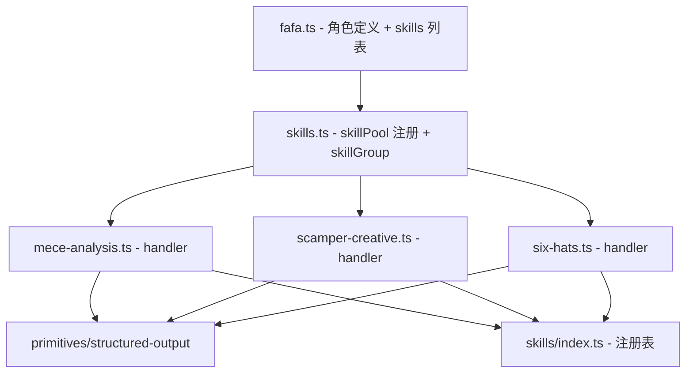

## 产品概述

重塑发发(fafa)小猫的角色定位，从"质量审核员(QA Reviewer)"转型为"创意策划师(Creative Strategist)"，赋予其 AI 驱动的头脑风暴方法论技能体系。

## 核心功能

### 1. MECE 问题拆解法 (mece-analysis)

将用户输入的复杂问题按 MECE 原则（Mutually Exclusive, Collectively Exhaustive，相互独立、完全穷尽）拆解为多层子问题树。输出结构化 JSON，包含问题维度、各维度下的子问题、以及每个子问题的分析方向和优先级。

### 2. SCAMPER 创意改造 (scamper-creative)

对用户输入的产品、方案或概念，从 SCAMPER 七个维度进行创意发散：

- Substitute（替代）
- Combine（合并）
- Adapt（调整）
- Modify（修改）
- Put to other uses（另作他用）
- Eliminate（消除）
- Reverse（反转）

每个维度输出具体创意点和可行性评估，形成结构化 JSON 报告。

### 3. 六顶思考帽 (six-hats)

用 De Bono 六顶思考帽方法从六种思维视角分析问题：

- 白帽（事实数据）
- 红帽（直觉情感）
- 黑帽（风险质疑）
- 黄帽（乐观价值）
- 绿帽（创意方案）
- 蓝帽（全局总结）

每顶帽子输出对应角度的分析要点，最终汇总为结构化 JSON 报告。

### 4. 发发角色重塑

修改发发的角色信息：id 保持 'reviewer'（数据库兼容），role 改为 'Creative Strategist'，更新描述、性格设定、系统提示词、技能列表和气泡消息，体现创意策划师定位。同步更新技能组定义。

## 技术栈

- 前端框架：React + TypeScript（现有项目）
- 技能原型：基于 `structured-output` 原型（text 输入 -> LLM 处理 -> JSON 结构化输出）
- AI 调用：通过 `executePrimitive('structured-output', ctx, config)` 调用 Dify/Qwen

## 实现方案

### 整体策略

三个头脑风暴技能均基于 `structured-output` 原型实现，核心差异在于各自的 system prompt 和输出 JSON schema。每个 skill 按照项目现有的 handler 模式（如 `content-review.ts`、`generate-outline.ts`）实现，通过精心设计的 system prompt 引导 LLM 按对应方法论框架输出结构化分析结果。

### 关键技术决策

1. **原型选择**：三个 skill 全部使用 `structured-output` 原型，因为它们本质都是"文本问题输入 -> LLM 按框架分析 -> JSON 结构化输出"，与现有 `content-review`、`generate-outline` 模式完全一致。
2. **技能分类**：新增 `content` 类别，因为头脑风暴方法属于"内容创作"前的思维发散工具，放在内容创作分类最为合理。
3. **fafa.id 保持不变**：id 仍为 `'reviewer'` 以保持数据库中已有猫猫记录的兼容性，仅更新 role/description/systemPrompt 等展示信息。
4. **skillGroup 更新**：将 `qa` 技能组改为 `creative`（创意策划），更新对应的 skillIds 和描述。

## 实现细节

### System Prompt 设计要点

- **MECE**：引导 LLM 先识别问题主题，再按 MECE 原则确定 3-5 个互不重叠的分析维度，每个维度下列出 2-4 个子问题，输出层级树状 JSON。
- **SCAMPER**：要求 LLM 对输入主题严格按 S/C/A/M/P/E/R 七个维度各生成 1-3 个具体创意，附带可行性评分(1-5)和实施建议。
- **六顶思考帽**：要求 LLM 分别戴上白/红/黑/黄/绿/蓝六顶帽子，每顶帽子输出 2-4 个分析要点，蓝帽做全局总结和行动建议。

### Prompt 输入提取

复用项目现有模式：从 `ctx.input` 提取用户输入文本。支持 string 直接输入、对象中的 `_params.topic` / `text` / `_action` 等字段提取。

## 架构设计

### 数据流

```
用户输入问题文本 -> skill handler 提取 prompt
  -> executePrimitive('structured-output', ctx, { systemPrompt, schema })
  -> LLM 按方法论框架生成 JSON
  -> 返回 SkillResult { success, data, summary, status }
```

### 模块关系



## 目录结构

```
frontend/src/
├── data/
│   └── cats/
│       └── fafa.ts                    # [MODIFY] 重塑发发角色：role/description/systemPrompt/skills/messages 全部更新为创意策划师定位
├── data/
│   └── skills.ts                      # [MODIFY] 1) 在 skillPool 中注册三个新 SkillTemplate (mece-analysis/scamper-creative/six-hats)；2) 将 skillGroup 'qa' 改为 'creative' 创意策划组
├── skills/
│   ├── index.ts                       # [MODIFY] 导入并注册三个新 handler 到 handlers 数组
│   ├── mece-analysis.ts               # [NEW] MECE 问题拆解法 handler，通过 structured-output 原型调用 LLM，输出层级子问题树 JSON
│   ├── scamper-creative.ts            # [NEW] SCAMPER 创意改造 handler，通过 structured-output 原型从七个维度发散创意，输出结构化创意报告 JSON
│   └── six-hats.ts                    # [NEW] 六顶思考帽 handler，通过 structured-output 原型从六种思维视角分析问题，输出多帽分析 JSON
```

## Agent Extensions

### SubAgent

- **code-explorer**
- Purpose: 在实现过程中如需确认其他猫猫文件中的具体写法细节或主题色定义，快速检索参考
- Expected outcome: 获取准确的代码模式和引用路径