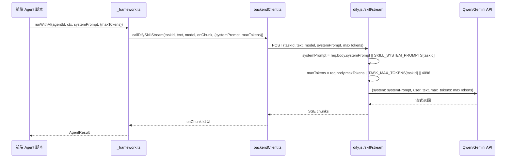

## 用户需求

优化「网页制作」工作流的前端执行路径，解决线上运行时两个关键问题。

## 产品概述

当前线上「网页制作」工作流有4个串联步骤（花椒-产品策划、阿蓝-交互设计、墨墨-视觉设计、琥珀-前端工程），通过前端 Agent 框架调用后端 AI 接口执行。执行结果存在两个严重问题需要修复。

## 核心问题

### 问题 1：步骤返回内容不符合预期

每个步骤应输出专业的结构化内容（JSON/Markdown/HTML），但实际输出的是角色扮演式的寒暄废话（"喵~收到任务！"）。根因是前端 Agent 框架将每个猫的专业 system prompt 拼进了 user message，而后端 `/skill/stream` 端点固定使用 `ai-chat` 的通用 system prompt（"你是一只友善的猫猫助手"）覆盖了专业指令。

### 问题 2：返回 token 太短

所有步骤统一走 `ai-chat` taskId，后端默认只分配 4096 tokens。对于交互设计文档（需 8K+）和 HTML 页面生成（需 12K+）严重不足，导致内容被截断无法生成完整网页。

## 修复目标

- 让每个猫角色的专业 system prompt 正确传递到后端 AI 调用，确保输出符合预期格式
- 为不同步骤配置合适的 maxTokens，确保有足够 token 空间生成完整内容
- 产品策划 8192 tokens、交互设计 8192 tokens、视觉设计 4096 tokens、前端工程 16384 tokens

## 技术栈

- 前端：React + TypeScript
- 后端：Node.js + Express.js
- AI 调用：Qwen (通义千问) / Gemini，通过 OpenAI 兼容格式的流式 SSE 接口

## 实现方案

### 核心策略

采用「前端传递自定义 systemPrompt 和 maxTokens 参数」的方案。修改前端 `callDifySkillStream` 函数和后端 `/skill/stream` 端点，支持前端在请求中携带自定义 `systemPrompt` 和 `maxTokens`，后端优先使用前端传入的值，否则 fallback 到 taskId 对应的默认值。

**选择此方案的理由**：

- 最小改动量（仅修改 2 个核心文件 + 4 个 agent 脚本的参数传递）
- 不需要在后端为每个猫角色维护重复的 prompt 配置
- 前端 agent 脚本已经包含了完善的专业 prompt，直接复用
- 向后兼容：其他使用 `callDifySkillStream` 的功能不受影响

### 安全性考虑

前端传入 systemPrompt 不存在安全风险，因为：

1. AI 调用本身就是执行用户请求的功能
2. 该接口已有 `optionalAuth` 中间件和配额检查
3. systemPrompt 只是指导 AI 输出格式，不涉及系统权限

## 实现细节

### 修改链路



### 关键改动点

1. **`frontend/src/utils/backendClient.ts`** — `callDifySkillStream` 函数增加 `systemPrompt` 和 `maxTokens` 可选参数，在请求 body 中传递
2. **`backend/routes/dify.js`** — `/skill/stream` 端点从 `req.body` 中解构 `systemPrompt` 和 `maxTokens`，优先使用前端传入的值
3. **`frontend/src/agents/_framework.ts`** — `runWithAI` 函数接受 `maxTokens` 配置，将 systemPrompt 作为独立参数传递而非拼入 user text
4. **4 个前端 agent 脚本** — 传入各自的 `maxTokens` 配置

### maxTokens 配置策略

| 步骤 | 当前值 | 调整后 | 理由 |
| --- | --- | --- | --- |
| 产品策划 (JSON) | 4096 | 8192 | JSON 结构含多页面多模块，需充足空间 |
| 交互设计 (Markdown) | 4096 | 8192 | 详细交互文档需要充足篇幅 |
| 视觉设计 (风格选择) | 4096 | 4096 | 仅输出风格编号+理由，当前够用 |
| 前端工程 (HTML) | 4096 | 16384 | 完整 HTML 页面含 CSS/JS 需大量 token |


### 后端同步修改

后端 `dify.js` 的非流式端点 `/skill` 也需同步支持 `systemPrompt` 和 `maxTokens` 参数，保持一致性。同时为 `maxTokens` 设置上限 `32768` 防止滥用。

## 注意事项

- **向后兼容**：不传 systemPrompt/maxTokens 时行为完全不变，不影响其他功能
- **Prompt 不再拼接**：前端框架改为将 systemPrompt 独立传递，user text 只包含上游输入，避免 system prompt 被当作 user message 的一部分降低效果
- **visual-designer.ts 特殊处理**：该 agent 不经过 `_framework.ts` 的 `runWithAI`，而是直接调用 `callDifySkillStream`，需单独修改其调用方式以传递 systemPrompt
- **maxTokens 上限防护**：后端对前端传入的 maxTokens 做 `Math.min(requestedMaxTokens, 32768)` 限制

## 目录结构

```
frontend/src/
├── utils/
│   └── backendClient.ts          # [MODIFY] callDifySkillStream 增加 systemPrompt/maxTokens 参数
├── agents/
│   ├── _framework.ts             # [MODIFY] runWithAI 改为独立传递 systemPrompt，支持 maxTokens 配置
│   ├── product-architect.ts      # [MODIFY] 传入 maxTokens: 8192
│   ├── ux-designer.ts            # [MODIFY] 传入 maxTokens: 8192
│   ├── visual-designer.ts        # [MODIFY] 调用 callDifySkillStream 时传入 systemPrompt 和 maxTokens
│   └── frontend-engineer.ts      # [MODIFY] 传入 maxTokens: 16384
backend/
└── routes/
    └── dify.js                   # [MODIFY] /skill/stream 和 /skill 端点支持接收 systemPrompt/maxTokens
```

## Agent Extensions

### SubAgent

- **code-explorer**
- 用途：在实现过程中验证修改的完整性，确认所有调用 `callDifySkillStream` 的地方是否需要同步更新
- 预期结果：确保修改不遗漏任何调用点，不引入回归问题