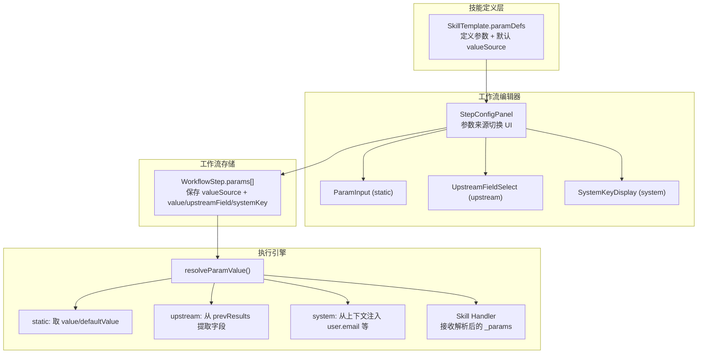

## 产品概述

为工作流系统中的 Skill 参数引入"值来源"(valueSource) 机制，使每个参数能独立声明其值的获取方式：可以是用户手动配置的静态值、来自上一步节点输出的特定字段、或由系统自动注入的上下文信息（如用户注册邮箱）。以"发送邮件"技能为典型案例，完善参数定义、编辑器 UI、前后端执行引擎的端到端传递链路。

## 核心功能

### 1. 参数值来源类型扩展

每个 StepParam 新增 `valueSource` 字段，支持三种来源模式：

- **static**（静态配置）：用户在工作流编辑器中手动填写固定值，如邮件主题、抄送列表
- **upstream**（来自上游节点）：从上一步或指定前序步骤的输出中自动获取值，如邮件内容取自前序 AI 生成的 text 字段；需配置 `upstreamField` 指定取哪个字段
- **system**（系统注入）：执行时由系统自动填充的上下文值，如 `user.email`（当前用户注册邮箱）；需配置 `systemKey` 指定注入哪个系统变量

### 2. 发送邮件技能参数完善（示例驱动）

`send-email` 新增 `body`（邮件内容）参数，完整参数定义：

- **body**（邮件内容）：默认来源 upstream（取上一步输出的 text/summary），也可切换为 static 手动填写
- **to**（收件邮箱）：默认来源 system（取 user.email），可切换为 static 手动指定
- **subject**（邮件主题）：默认来源 static，用户直接填写
- **cc**（抄送）：来源 static，tags 类型输入

### 3. 编辑器 UI 中的来源选择

StepConfigPanel 中每个参数卡片顶部新增"值来源"切换器，显示当前来源模式及对应的配置控件：

- static 模式：显示常规输入控件（文本框 / 下拉 / tags 等）
- upstream 模式：显示下拉选择器，选择要引用的上游输出字段名
- system 模式：显示只读标签，提示系统会自动注入的值（如"执行时使用用户注册邮箱"）

### 4. 前后端执行引擎参数解析

工作流执行时，根据每个参数的 valueSource 自动从对应来源获取最终值：

- 前端 TeamDetailPage 执行逻辑：从 stepResults 中提取 upstream 字段值，从 AuthContext 获取 system 值
- 后端 workflow-executor.js：从 prevResults 中提取 upstream 字段值，从数据库查询 system 值（user.email）
- 最终将所有参数的解析值合并为 `_params` 对象，注入到 skill handler 的 input 中

## 技术栈

- 前端：React + TypeScript + Tailwind CSS（沿用现有项目栈）
- 后端：Node.js + Express + Prisma（沿用现有项目栈）

## 实现方案

### 核心设计：参数值来源（ValueSource）机制

在现有 `StepParam` 接口基础上，新增 `valueSource` 及相关配置字段，实现参数级别的值来源声明。这是一个对现有架构影响最小的增量式扩展：不改变已有的 `value` / `defaultValue` 语义，而是在其上层增加来源路由逻辑。

**关键决策：**

- `valueSource` 默认为 `'static'`，确保所有已有 paramDefs 无需修改即可正常工作（向后兼容）
- upstream 模式通过 `upstreamField` 指定从上游输出对象中取哪个 key，而非整个 inputFrom（inputFrom 是步骤级别的，此处是参数级别的精细映射）
- system 模式通过预定义的 `systemKey` 枚举（如 `'user.email'`）实现，避免任意注入带来的安全问题
- 参数解析优先级：如果 valueSource 为 upstream 但上游无对应字段，回退到 static value 或 defaultValue；如果 system 值也为空，同样回退

### 实现方案详情

**1. 类型层扩展** (`types.ts`)

在 `StepParam` 接口新增三个可选字段：

```typescript
valueSource?: 'static' | 'upstream' | 'system'  // 默认 'static'
upstreamField?: string   // valueSource='upstream' 时，从上游输出取哪个字段
systemKey?: string       // valueSource='system' 时，注入哪个系统变量
```

同时新增 `ParamValueSource` 类型别名和 `SYSTEM_KEYS` 常量，限定可用的系统注入变量。

**2. 技能定义层** (`skills.ts`)

完善 send-email 的 paramDefs，增加 `body` 参数并为各参数配置合理的默认 valueSource：

- body: `valueSource: 'upstream', upstreamField: 'text'`
- to: `valueSource: 'system', systemKey: 'user.email'`
- subject / cc: 保持默认 `valueSource: 'static'`

**3. UI 层** (`StepConfigPanel.tsx`)

在每个参数卡片中增加来源选择器（三个小按钮组），切换时更新 param 的 valueSource 并联动显示对应的输入控件：

- static: 沿用现有 ParamInput 组件
- upstream: 新增 UpstreamFieldSelect 组件（简单文本输入 + 常用字段建议下拉：text / summary / notes / html）
- system: 新增 SystemKeyDisplay 组件（只读展示，如"运行时自动使用用户注册邮箱"）

**4. 前端执行引擎** (`TeamDetailPage/index.tsx`)

修改 `handleConfirmRun` 和步骤执行 useEffect 中的参数解析逻辑，新增 `resolveParamValue` 函数：

- static: 取 `p.value ?? p.defaultValue`（现有逻辑）
- upstream: 从 `stepResultsRef.current` 中查找前序步骤的输出，提取 `upstreamField` 对应字段
- system: 从 AuthContext 获取（当前仅支持 `user.email`，从 `useAuth().user.email` 获取）

**5. 后端执行引擎** (`workflow-executor.js`)

修改 `executeStep` 函数中参数合并逻辑，对每个 param 根据 valueSource 解析最终值：

- static: 取 `p.value ?? p.defaultValue`（现有逻辑）
- upstream: 从 `prevResults` 中提取指定字段
- system: 从已查询的 `userEmail` 等上下文中取值

将解析后的值统一放入 `merged._params` 并同时平铺到 `merged` 顶层（用于邮件技能的 `merged.to` / `merged.subject` 兼容）。

**6. send-email skill handler 更新**

前端 `send-email.ts` 和原型 `email-send.ts` 需要适配 `_params` 中的新字段（body/cc），将 params.body 作为邮件正文、params.cc 传递给 sendEmail API。后端 `workflow-executor.js` 邮件分支也需从 `_params` 中提取 body 和 cc。

## 实现注意事项

- **向后兼容**：所有已有的 paramDefs 不含 valueSource 字段时默认为 `'static'`，现有工作流配置无需迁移
- **性能**：参数解析是纯同步操作（查已有内存数据），无额外网络开销
- **错误处理**：upstream 字段不存在时回退到 static 值并在执行日志中输出 warning；system key 未匹配时同理
- **安全**：systemKey 使用白名单枚举，不允许任意 key 注入

## 架构设计



## 目录结构

```
frontend/src/
├── data/
│   └── types.ts                    # [MODIFY] StepParam 新增 valueSource / upstreamField / systemKey 字段，新增 ParamValueSource 类型和 SYSTEM_KEYS 常量
├── data/
│   └── skills.ts                   # [MODIFY] send-email 的 paramDefs 增加 body 参数，各参数配置 valueSource 默认值
├── pages/TeamDetailPage/
│   ├── workflow-canvas/
│   │   └── StepConfigPanel.tsx     # [MODIFY] 参数卡片增加来源选择器 UI（static/upstream/system 三态切换），upstream 时显示字段选择、system 时显示只读提示
│   └── index.tsx                   # [MODIFY] 步骤执行逻辑中的参数解析增加 resolveParamValue 函数，支持三种来源的值获取
├── skills/
│   ├── send-email.ts               # [MODIFY] 从 input._params 中提取 body/to/subject/cc 参数传递给原型
│   └── primitives/
│       └── email-send.ts           # [MODIFY] 适配 _params 中的 body 和 cc 字段，cc 传递给 sendEmail API
├── components/
│   └── WorkflowPanel.tsx           # [MODIFY] 步骤执行逻辑增加 params 解析（与 TeamDetailPage 保持一致）
backend/
└── workflow-executor.js            # [MODIFY] executeStep 中参数解析逻辑增加 valueSource 分支处理，邮件技能适配 body/cc
```

## 关键类型定义

```typescript
/** 参数值来源类型 */
export type ParamValueSource = 'static' | 'upstream' | 'system';

/** 可用的系统注入 key 白名单 */
export const SYSTEM_KEYS = {
  'user.email': '用户注册邮箱',
  'user.name': '用户名称',
  'workflow.name': '工作流名称',
  'timestamp': '当前时间戳',
} as const;

export type SystemKey = keyof typeof SYSTEM_KEYS;

export interface StepParam {
  key: string;
  label: string;
  type: StepParamType;
  placeholder?: string;
  defaultValue?: string | number | boolean | string[];
  options?: { label: string; value: string }[];
  required?: boolean;
  description?: string;
  value?: string | number | boolean | string[];
  /** 参数值的来源方式，默认 'static' */
  valueSource?: ParamValueSource;
  /** valueSource='upstream' 时，从上游步骤输出中提取的字段名 */
  upstreamField?: string;
  /** valueSource='system' 时，注入的系统上下文变量 key */
  systemKey?: SystemKey;
}
```

## Agent Extensions

### SubAgent

- **code-explorer**
- 目的：在实现阶段需要追踪 sendEmail API 的完整调用链（backendClient.ts 中的 sendEmail 函数签名、后端 email 路由），确认 cc 参数的端到端传递路径
- 预期结果：确认 sendEmail 是否已支持 cc 参数、后端 SMTP 发送是否需要同步修改