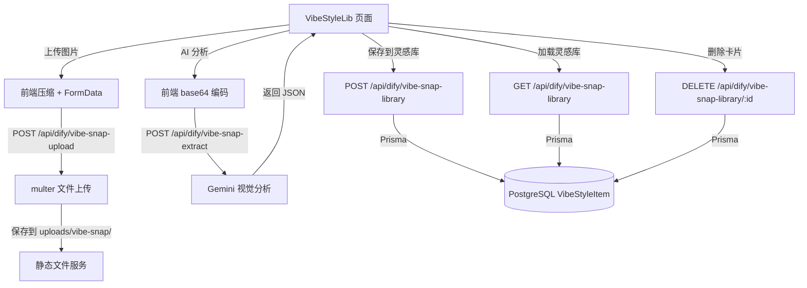

## 用户需求

用户从其他项目复制了一个"Vibe Style Lib"页面到当前 CuCaTopia 项目中，该页面实现了上传图片 → AI 分析设计风格元素和提示词 → 展示/保存到灵感库的功能。需要将这个页面与当前项目进行适配整合，修复所有兼容性问题，并实现对应的后端 API。

## 产品概述

Vibe Style Lib 是一个设计风格分析工具，包含两个核心模块：

- 灵感库：展示已分析保存的设计风格卡片（含缩略图、风格标签、色板、摘要），支持查看详情、删除
- 提取器：上传/拖拽/粘贴图片，AI 自动分析返回设计总结（风格描述、色板、字体排版、视觉属性）和设计提示词，可保存到灵感库

## 核心功能

1. 图片上传与压缩：支持点击、拖拽、粘贴三种方式上传图片，前端自动压缩大图
2. AI 风格分析：将图片发送到后端，调用 Gemini 视觉模型分析设计风格，返回结构化的设计总结和提示词
3. 灵感库管理：保存、浏览、查看详情、删除灵感卡片，数据持久化到 PostgreSQL
4. 图片文件存储：后端接收上传的图片文件，保存到服务器 uploads 目录并返回可访问 URL

## 技术栈

- 前端：React 19 + TypeScript + Tailwind CSS v4 + Vite 6 + react-router-dom v6
- 后端：Express.js + Prisma ORM + PostgreSQL + multer（新增）
- AI：Google Gemini（`@google/genai`，利用已有的视觉模型调用能力）
- 认证：JWT Bearer token，复用已有的 authMiddleware / optionalAuth

## 实现方案

整体策略分为三部分：后端新增 API 和数据模型、前端适配修复、前后端联调。

**后端部分**：在现有 `routes/dify.js` 中新增 vibe-snap 相关路由（与现有 AI 路由同属一组），利用已有的 Gemini 客户端调用视觉分析能力。新增 Prisma 模型 `VibeStyleItem` 存储灵感库数据。安装 multer 处理图片上传，创建 uploads 目录。

**前端部分**：修复所有导入错误（缺失的 types 文件、userStore 替换为 AuthContext、UserAvatar 替换为项目已有组件），安装 clsx 依赖，统一 API 函数命名和路径前缀，修复路由 typo。

**AI 分析方案**：使用 Gemini 的 `generateContent` API 发送图片 base64 + 结构化提示词，要求返回 JSON 格式的设计总结（styleDescription、styleTags、colors、typography、visualAttributes）和设计提示词。这与项目已有的 Gemini 调用模式一致，复用 `createGeminiClient` 函数。

## 实现细节

### 后端 API 设计

路由前缀统一为 `/api/dify/vibe-snap-*`（挂载在已有的 dify 路由文件中）：

| 方法 | 路径 | 认证 | 说明 |
| --- | --- | --- | --- |
| POST | `/api/dify/vibe-snap-extract` | optionalAuth | AI 分析图片 |
| GET | `/api/dify/vibe-snap-library` | optionalAuth | 获取灵感库列表 |
| POST | `/api/dify/vibe-snap-library` | optionalAuth | 保存灵感卡片 |
| DELETE | `/api/dify/vibe-snap-library/:id` | optionalAuth | 删除灵感卡片 |
| POST | `/api/dify/vibe-snap-upload` | optionalAuth | 上传图片文件 |


### Prisma 数据模型

```
model VibeStyleItem {
  id             String   @id @default(uuid())
  userId         String?
  imageUrl       String
  tags           Json     // string[]
  colors         Json     // string[]
  summary        String   @db.Text
  designSummary  Json     // VibeSnapDesignSummary 对象
  designPrompt   String   @db.Text
  ownerName      String   @default("")
  createdAt      DateTime @default(now())
  @@index([userId])
}
```

### AI 提示词设计

向 Gemini 发送图片时附带结构化 system prompt，要求返回严格 JSON 格式：

- `designSummary`：包含 styleDescription、styleTags、colors（name/hex/usage）、typography（family/note）、visualAttributes（borderRadius/shadow/border/spacing）
- `designPrompt`：完整的设计提示词文本
- `libraryBlurb`：一句话摘要

### 图片上传方案

使用 multer 配置：

- 存储目录：`backend/uploads/vibe-snap/`
- 文件大小限制：10MB
- 文件类型限制：image/png、image/jpeg、image/webp、image/gif
- 文件名：`{uuid}-{timestamp}.{ext}`
- 静态服务：复用已有的 `app.use('/uploads', express.static('uploads'))`

### 前端适配要点

1. 新建 `types.ts` 文件，统一类型定义（复用 vibeStyleLibApi.ts 中的类型并 re-export）
2. 删除 `getUserInfo` 和 `UserAvatar` 导入，移除原有自定义 Header，改用项目默认 Navbar 组件
3. API 路径从 `/api/v1/ai/vibe-snap-*` 改为 `/api/dify/vibe-snap-*`，去掉 `VITE_API_BASE_URL` 前缀
4. 统一函数命名，vibeStyleLibApi.ts 中的导出名对齐 index.tsx 中的导入名
5. 安装 clsx 依赖
6. 新增邮箱白名单路由守卫：仅 `minhansu508@gmail.com` 用户可访问该页面，其他用户重定向到 dashboard

### 性能考虑

- 图片上传使用 FormData（已有），避免 base64 膨胀
- AI 分析使用前端压缩后的 base64（已有 compressImage 逻辑）
- 灵感库列表查询按 createdAt DESC 排序，暂无分页（数据量小）
- Gemini 视觉分析超时设置 90s（与现有 Qwen 调用一致）

### 向后兼容

- 前端 localStorage 缓存（STORAGE_KEY: vibesnap-library-v1）作为降级方案保留
- optionalAuth 允许未登录用户也能使用提取器（但无法保存到灵感库）
- 所有新增路由在 dify.js 中追加，不修改已有路由逻辑

## 架构设计



## 目录结构

```
backend/
├── routes/
│   └── dify.js                          # [MODIFY] 追加 vibe-snap 相关的 5 个路由端点（extract/upload/library CRUD），包含 Gemini 视觉分析 prompt、multer 配置、Prisma 操作
├── prisma/
│   └── schema.prisma                    # [MODIFY] 新增 VibeStyleItem 模型定义
├── uploads/
│   └── vibe-snap/                       # [NEW] 图片上传存储目录（需创建）
├── index.js                             # [MODIFY] 确保 uploads 静态服务和 body-parser limit 满足需求（已有，无需改动或仅微调）
└── package.json                         # [MODIFY] 添加 multer 依赖

frontend/
├── src/
│   ├── main.tsx                         # [MODIFY] 修复路由路径 typo（vide → vibe），添加前导 /，新增邮箱白名单路由守卫（仅 minhansu508@gmail.com），用 ProtectedRoute 包裹
│   ├── pages/
│   │   └── VibeStyleLib/
│   │       ├── index.tsx                # [MODIFY] 删除 getUserInfo/UserAvatar 导入，移除自定义 Header 改用 Navbar，修复函数名对齐 API 文件，移除 @/ 路径别名改为相对路径
│   │       ├── vibeStyleLibApi.ts       # [MODIFY] 统一导出函数名与 index.tsx 一致，API 路径从 /api/v1/ai/ 改为 /api/dify/，添加 JWT token 头，修复 upload URL 拼接
│   │       └── types.ts                 # [NEW] 类型定义文件，定义 VibeStyleLibLibraryItem 和 VibeStyleLibExtractResult 类型（映射自 vibeStyleLibApi.ts 中的 VibeSnap* 类型）
│   └── package.json                     # [MODIFY] 添加 clsx 依赖
```

## Agent Extensions

### SubAgent

- **code-explorer**
- Purpose: 在实施过程中探索和确认后端 dify.js 中 Gemini 客户端调用方式、optionalAuth 中间件实现细节、Prisma schema 当前索引策略等，确保新增代码与现有模式完全一致
- Expected outcome: 获取精确的代码模式和约定，避免实施时出现风格不一致或接口不兼容的问题