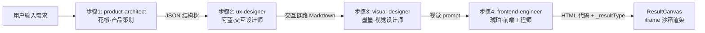
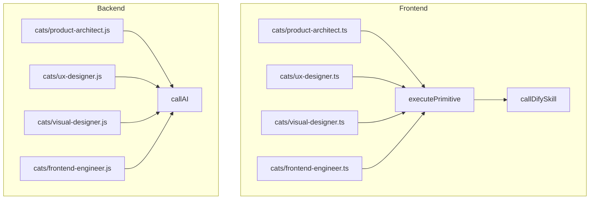

## 产品概述

实现「网页制作流水线」工作流中 4 只猫猫的真实 AI 脚本，使其从占位框架升级为可真正执行的 AIGC 流水线，同时让结果画布区域能够以 HTML 预览容器展示最终生成的网页。

**关键变更：工作流使用 `officialCatsCommunity.ts` 中定义的 4 只猫猫：**

- `product-architect`（花椒 - 产品策划）
- `ux-designer`（阿蓝 - 交互设计师）
- `visual-designer`（墨墨 - 视觉设计师）
- `frontend-engineer`（琥珀 - 前端工程师）

需要先修改 `workflows.ts` 中的 agentId 映射，并在模板 ID 注册表中新增这 4 个 ID。

## 核心功能

### 1. 产品策划猫 (product-architect / 花椒) -- 步骤 1

- 根据用户输入的建站需求，调用 AI 生成 JSON 格式的网站信息架构结构树
- 输出内容包括：建站目标、受众、页面树（站点地图）、各页核心模块与内容要点
- 以字符串类型输出 JSON 结构树，供下游步骤引用

### 2. 交互设计师猫 (ux-designer / 阿蓝) -- 步骤 2

- 接收上游产品架构 JSON，调用 AI 补充交互链路
- 输出核心用户路径、页面间跳转关系、组件级交互说明、空态与加载建议
- 以 Markdown 文本输出，承上启下

### 3. 视觉设计师猫 (visual-designer / 墨墨) -- 步骤 3

- 接收上游架构+交互文稿，从内置的视觉 prompt 库中让 AI 匹配最符合的视觉方向
- 输出视觉 prompt：主色/辅色、字体气质、圆角与间距、组件风格关键词
- 以文本输出，供前端工程师步骤消费

### 4. 前端工程师猫 (frontend-engineer / 琥珀) -- 步骤 4

- 综合前三步信息（架构、交互、视觉），调用 AI 生成完整可运行的 HTML 单页代码
- 输出纯 HTML 字符串（含内联 CSS/JS），data 中同时标记 `_resultType: 'html-page'`

### 5. 结果画布 HTML 预览

- ResultCanvas 识别最终步骤输出中的 HTML 标记（`_resultType: 'html-page'`）
- 使用 sandboxed iframe 安全渲染生成的 HTML 页面，替代纯文本展示
- 同时保留文本摘要和执行过程折叠面板

### 6. 后端步骤结果存储增强

- workflow-executor 的 stepsData 中增加 `resultType` 字段，从步骤结果 data 中提取
- 最后一步的完整 HTML 内容通过 summary 传递给前端（或截断后附带标记）

## 技术栈

- 后端：Node.js (Express) + Prisma ORM，AI 调用使用已有的 `callAI()` 统一入口（Qwen/Gemini）
- 前端：React + TypeScript + Tailwind CSS，技能通过 `executePrimitive('text-to-text')` + `callDifySkill` 调用 AI
- 数据流：步骤间通过 `data.text` 字符串传递，最终结果通过 `WorkflowRun.steps[].summary` 传到前端

## 实现方案

### 核心策略

将 4 个猫脚本从 `runPlaceholder` 占位升级为真正调用 AI 的脚本。前后端脚本保持一致的 prompt 设计和输出格式。每个脚本的核心是精心设计的 system prompt + 上游数据拼装 + AI 调用 + 结果规范化。

### 关键技术决策

**1. AI 调用方式**

- 后端脚本：直接使用 `workflow-executor.js` 中已暴露的 `callAI(systemPrompt, userText, model, maxTokens)` 函数。为避免循环依赖，后端猫脚本通过 ctx 参数注入 callAI（在 `_framework.js` 中新增 `runWithAI` 辅助函数，封装重试+超时+日志）。
- 前端脚本：使用已有的 `executePrimitive('text-to-text', ctx, config)` 调用链（最终走 `callDifySkill`），与 `ai-chat.ts` 模式一致。

**2. 步骤间数据传递格式**

- 所有步骤输出统一 `data: { text: string, _resultType?: string }`，`summary` 为人类可读摘要。
- 步骤 1 (product-architect)：`data.text` = JSON 结构树字符串
- 步骤 2 (ux-designer)：`data.text` = 交互链路 Markdown
- 步骤 3 (visual-designer)：`data.text` = 视觉 prompt 文本
- 步骤 4 (frontend-engineer)：`data.text` = 完整 HTML 代码，`data._resultType = 'html-page'`

**3. HTML 结果传递到 ResultCanvas**

- 后端 `workflow-executor.js` 的 `stepsData` 增加 `resultType` 和 `resultData` 字段，从 `result.data._resultType` 和 `result.data.text` 中提取
- 前端 `WorkflowRunStep` 类型新增 `resultType?: string` 和 `resultData?: string`
- `ResultCanvas` 检测 `lastStep.resultType === 'html-page'` 时切换为 iframe 沙箱渲染

**4. 视觉 prompt 库**

- 在后端 `backend/lib/cat-step-scripts/` 新增 `visual-prompt-library.js`，内置 8-12 套预定义视觉风格 prompt（科技蓝、暖橙商务、极简黑白、渐变紫等）
- 前端对应新增 `frontend/src/skills/cats/visual-prompt-library.ts`
- AI 根据上游内容从库中匹配最合适的风格并输出

## 实现要点

### Prompt 设计原则

- 步骤 1 的 system prompt 要求 AI 输出严格 JSON（顶层对象含 goal, audience, siteMap, pages 字段）
- 步骤 4 的 system prompt 要求 AI 输出完整可运行的 HTML（<!DOCTYPE html>...），禁止 markdown 包裹
- 每个 prompt 限定输出语言为中文内容+英文代码

### 性能与可靠性

- 后端猫脚本使用 `maxTokens: 8192` 保证步骤 4 HTML 输出完整性
- 步骤 1-3 使用 `maxTokens: 4096` 足够
- 前端脚本统一 2 次重试 + 60s 超时保护（参考 `ai-chat.ts` 模式）
- HTML 提取：若 AI 输出被 markdown 代码块包裹，脚本自动 strip ```html...``` 标记

### 向后兼容

- `WorkflowRunStep` 新字段为可选（`resultType?: string`），不影响已有 run 数据
- `ResultCanvas` 无 `resultType` 时仍走原有文本展示逻辑
- 后端 stepsData 新字段不影响 Prisma JSON 列的写入（steps 列为 Json 类型）

## 架构设计

### 数据流



### 前后端脚本对齐关系



## 目录结构

```
backend/lib/cat-step-scripts/
├── _framework.js                # [MODIFY] 新增 runWithAI 辅助函数（封装 callAI + 日志 + 重试）
├── visual-prompt-library.js     # [NEW] 视觉风格 prompt 预定义库（8-12 套风格）
├── index.js                     # 无需修改，已按 templateId 动态加载
└── cats/
    ├── product-architect.js     # [NEW] 产品策划：产品架构 JSON 生成
    ├── ux-designer.js           # [NEW] 交互设计师：交互链路补充
    ├── visual-designer.js       # [NEW] 视觉设计师：视觉 prompt 匹配
    └── frontend-engineer.js     # [NEW] 前端工程师：HTML 页面生成

backend/data/
└── official-cats.js             # [MODIFY] 新增 4 个模板 ID

backend/
└── workflow-executor.js         # [MODIFY] stepsData 增加 resultType/resultData 字段存储

frontend/src/skills/cats/
├── _framework.ts                # [MODIFY] 新增 runWithAI 辅助函数（封装 executePrimitive + 重试 + 超时）
├── visual-prompt-library.ts     # [NEW] 视觉风格 prompt 预定义库（与后端对齐）
├── official-template-ids.ts     # [MODIFY] 新增 4 个模板 ID
├── index.ts                     # [MODIFY] 注册 4 个新猫脚本到 HANDLERS
├── product-architect.ts         # [NEW] 产品策划：产品架构 JSON 生成
├── ux-designer.ts               # [NEW] 交互设计师：交互链路补充
├── visual-designer.ts           # [NEW] 视觉设计师：视觉 prompt 匹配
└── frontend-engineer.ts         # [NEW] 前端工程师：HTML 页面生成

frontend/src/data/
└── workflows.ts                 # [MODIFY] agentId 从旧 ID 改为新的 4 只猫 ID
```

## 关键代码结构

```typescript
/** 后端 _framework.js 新增的 AI 调用辅助 */
// runWithAI(templateId, ctx, systemPrompt, userText, options?)
// - 封装 callAI + 结构化日志 + 90s 超时
// - 返回 { success, data: { text, _resultType? }, summary, status }

/** 前端 _framework.ts 新增的 AI 调用辅助 */
// runWithAI(templateId, ctx, systemPrompt, options?)
// - 封装 executePrimitive('text-to-text') + 2次重试 + 60s超时
// - 自动从 ctx.input 提取上游文本
// - 返回 SkillResult

/** WorkflowRunStep 新增字段 */
interface WorkflowRunStep {
  // ...existing fields
  resultType?: string;   // 'html-page' | 'json' | 'text' (default)
  resultData?: string;   // 最终步骤的完整输出内容
}
```

## Agent Extensions

### SubAgent

- **code-explorer**
- Purpose: 在实现各步骤时精确定位上下游数据格式、已有 prompt 模式和 AI 调用参数约定
- Expected outcome: 确保每个猫脚本的输入解析和输出格式完全匹配工作流执行引擎的预期