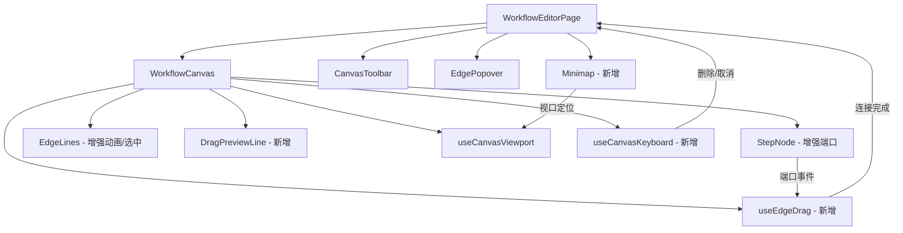

## 用户需求

优化工作流节点画布，参考 Dify 画布交互体验，提升画布的专业性和可操作性。

## 产品概述

在现有工作流画布基础上，升级交互能力，使其达到类似 Dify 工作流编辑器的操作体验。核心改进包括：节点连接端口（input/output port）可视化、从端口拖拽创建连线、拖拽中的实时预览线、连线动画流动效果、连线删除能力、小地图导航，以及键盘快捷键增强。

## 核心功能

1. **节点连接端口（Port）**：每个节点顶部显示输入端口、底部显示输出端口，hover/选中时端口高亮显示，开始节点仅有输出端口
2. **拖拽连线创建**：从输出端口拖出连线到目标节点的输入端口，拖拽过程中显示虚线预览线跟随鼠标，释放时完成连接并更新 `inputFrom` 数据关系
3. **连线交互增强**：连线 hover 高亮、点击选中可删除、SVG 流动动画（虚线流动效果）表示数据方向
4. **节点拖拽优化**：拖拽时节点有轻微阴影提升效果、连线实时跟随更新
5. **画布交互增强**：空格+拖拽进入画布平移模式、小地图（Minimap）显示全局视图并支持点击快速定位
6. **键盘快捷键**：Delete/Backspace 删除选中节点或连线、Ctrl+A 全选、Escape 取消选中

## 技术栈

- 前端框架：React + TypeScript（现有项目技术栈）
- 样式方案：Tailwind CSS（现有项目方案）
- 连线渲染：纯 SVG（保持现有方案，不引入第三方画布库）
- 视口管理：自定义 `useCanvasViewport` hook（已有，增强扩展）

## 实现方案

### 整体策略

在现有画布架构上渐进式增强，不替换核心架构。主要增加：连接端口系统、拖拽连线 hook、连线动画层、小地图组件、键盘快捷键 hook。所有新功能通过独立组件/hook 实现，通过 `WorkflowCanvas` 和 `WorkflowEditorPage` 进行组装集成。

### 关键技术决策

**1. 连接端口（Port）系统**
在 `StepNode` 组件中增加顶部输入端口和底部输出端口的 DOM 元素。端口为小圆点（8px），hover 时放大并高亮。开始节点仅渲染输出端口。端口需要携带 `data-port-type`（input/output）和 `data-port-index`（节点索引）属性，供拖拽连线系统识别目标。

**2. 拖拽连线（Edge Dragging）机制**
新建 `useEdgeDrag` hook 管理连线拖拽状态机。状态包含：`isDragging`、`sourceIndex`（输出端口所属节点索引）、`mousePos`（当前鼠标画布坐标）、`targetIndex`（悬浮在某输入端口上时的目标索引）。从输出端口 `pointerdown` 开始拖拽，`pointermove` 更新鼠标位置并检测是否悬浮在某个输入端口上（通过 `document.elementFromPoint` 检查 `data-port-type="input"` 属性），`pointerup` 时若有有效目标则触发 `onConnect(sourceIndex, targetIndex)` 回调更新 `inputFrom`。拖拽过程中在 SVG 层渲染一条虚线贝塞尔预览线（从源输出端口到鼠标位置）。

**3. 连线动画效果**
在 `EdgeLines` 组件的 SVG `<defs>` 中定义 `stroke-dasharray` + CSS `@keyframes` 动画，使连线呈现数据流动效果（虚线向箭头方向移动）。仅对已激活/选中的连线应用动画，避免大量连线同时动画造成性能问题。

**4. 连线选中与删除**
扩展 `EdgeLines` 支持连线选中态（点击连线后高亮+显示删除按钮），在连线中点渲染一个小型删除图标。删除操作清除目标节点的 `inputFrom` 字段。复用现有 `activeEdgeIndex` 状态。

**5. 小地图（Minimap）**
新建 `Minimap` 组件，渲染在画布右下角。使用 Canvas 2D API 绘制缩略版节点矩形和连线，显示当前视口范围框。支持点击/拖拽视口框快速定位。节点颜色使用简化的灰色/主题色区分。使用 `requestAnimationFrame` 节流渲染，仅在 `nodePositions` 或 `viewport` 变化时重绘。

**6. 键盘快捷键**
新建 `useCanvasKeyboard` hook，监听 `keydown` 事件：Delete/Backspace 删除选中项、Escape 取消选中、空格键切换拖拽模式光标。通过 `useEffect` 挂载到 `document` 上，组件卸载时清理。

### 性能考量

- 拖拽连线过程中的鼠标移动事件已有 rAF 节流机制，复用现有 `scheduleUpdate` 模式
- 小地图使用 Canvas 2D 而非 DOM/SVG，避免大量节点时的 DOM 开销
- 连线动画仅对选中连线启用，不对所有连线应用
- `elementFromPoint` 端口检测仅在拖拽状态下调用，不影响常规交互性能

## 实现注意事项

- 拖拽连线时需要考虑画布缩放（zoom），鼠标坐标转换为画布坐标时除以 zoom 值，复用现有 `WorkflowCanvas` 中的坐标转换逻辑
- 连线创建需要校验：不允许自连接、不允许连接到开始节点的输入端口、不允许创建环路（简单检查：目标索引不能小于源索引）
- 端口的 `pointerdown` 事件需要 `stopPropagation` 防止触发节点拖拽
- 空格键拖拽模式需防止页面滚动（`preventDefault`）
- 保持现有 `EdgePopover` 功能不变，作为连线配置的补充入口

## 架构设计



## 目录结构

```
frontend/src/pages/TeamDetailPage/workflow-canvas/
├── canvas-utils.ts              # [MODIFY] 新增端口坐标计算函数 getPortPosition()、连接校验函数 canConnect()
├── useCanvasViewport.ts         # [MODIFY] 新增空格键拖拽模式支持（isSpacePressed 状态）
├── useEdgeDrag.ts               # [NEW] 拖拽连线 hook。管理连线拖拽状态机（sourceIndex, mousePos, targetIndex），处理 pointerdown/move/up 事件，输出端口检测逻辑，触发 onConnect 回调
├── useCanvasKeyboard.ts         # [NEW] 键盘快捷键 hook。监听 Delete/Backspace/Escape/Space/Ctrl+A，调用删除节点/连线、取消选中等回调
├── StepNode.tsx                 # [MODIFY] 新增输入端口（顶部）和输出端口（底部）圆点 UI，端口 hover 放大高亮效果，端口 pointerdown 触发连线拖拽，拖拽时阴影提升效果
├── EdgeLines.tsx                # [MODIFY] 新增连线流动动画（stroke-dasharray + CSS animation），连线 hover 高亮和选中态样式，连线中点删除按钮 UI
├── DragPreviewLine.tsx          # [NEW] 拖拽预览线组件。SVG 虚线贝塞尔曲线，从源端口到鼠标位置，仅在拖拽状态下渲染
├── Minimap.tsx                  # [NEW] 小地图组件。Canvas 2D 渲染缩略节点和连线，显示视口范围框，支持点击/拖拽快速定位画布
├── WorkflowCanvas.tsx           # [MODIFY] 集成 useEdgeDrag/useCanvasKeyboard hook，渲染 DragPreviewLine 组件，传递端口事件到子组件，增加连线删除回调 prop
└── WorkflowEditorPage.tsx       # [MODIFY] 新增 onConnect/onDeleteEdge 回调处理连接创建与删除，集成 Minimap 组件，传递键盘操作相关回调
```

## 关键代码结构

```typescript
/** 端口坐标计算 - canvas-utils.ts */
export interface PortPosition {
  x: number;  // 端口中心 x（画布坐标）
  y: number;  // 端口中心 y（画布坐标）
}

export function getInputPortPos(nodePos: { x: number; y: number }): PortPosition;
export function getOutputPortPos(nodePos: { x: number; y: number }): PortPosition;
export function canConnect(sourceIdx: number, targetIdx: number, steps: { inputFrom?: string }[]): boolean;

/** 拖拽连线状态 - useEdgeDrag.ts */
export interface EdgeDragState {
  isDragging: boolean;
  sourceIndex: number;      // 输出端口所属节点索引
  mousePos: { x: number; y: number };  // 画布坐标
  targetIndex: number | null;  // 悬浮目标节点索引
}

export function useEdgeDrag(opts: {
  nodePositions: NodePositions;
  zoom: number;
  containerRef: React.RefObject<HTMLDivElement | null>;
  onConnect: (sourceIndex: number, targetIndex: number) => void;
}): {
  dragState: EdgeDragState;
  handlePortPointerDown: (nodeIndex: number, e: React.PointerEvent) => void;
};
```

## 代理扩展

### SubAgent

- **code-explorer**
- 用途：在实现各任务步骤前，搜索项目中可能存在的相关模式和工具函数，确保代码风格一致
- 预期结果：获取现有组件/hook 的编码模式以供新组件参考