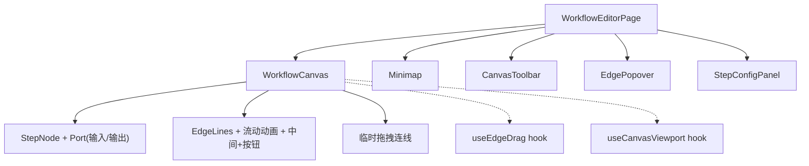

## 用户需求

优化工作流节点画布，参考 Dify 画布风格，增强画布的交互能力和视觉效果。

## 产品概述

对现有工作流画布进行交互升级，使其具备类似 Dify 等专业工作流编辑器的核心交互体验，包括节点连接端口、拖拽建立连线、连线动画、小地图导航等功能。

## 核心功能

1. **节点连接端口（Port）**：每个节点顶部显示输入端口、底部显示输出端口，hover/选中时端口高亮显示，为拖拽连线提供视觉锚点
2. **拖拽创建连线**：从节点输出端口拖出连线到目标节点输入端口，拖拽过程中显示虚线预览，松手后建立数据连接关系（更新 inputFrom）
3. **连线流动动画**：连线上添加 SVG 虚线流动动画（stroke-dashoffset），表现数据流向，提升画布动态感
4. **小地图（Minimap）**：画布右下角显示缩略导航图，展示所有节点位置和当前视口范围，可拖拽视口框快速定位
5. **开始节点输出端口**：开始节点底部也增加输出端口，保持视觉一致性
6. **边线中间添加按钮**：连线中点显示一个"+"按钮，点击可在两节点之间插入新步骤

## 技术栈

- 前端框架：React + TypeScript（沿用现有项目）
- 样式方案：Tailwind CSS v4 + 内联样式（沿用现有项目）
- 画布渲染：纯 SVG 连线 + CSS transform 视口（沿用现有自研方案，不引入第三方画布库）
- 动画：SVG stroke-dashoffset CSS 动画 + CSS keyframes

## 实现方案

### 整体策略

在现有画布架构基础上渐进增强，不改变核心数据模型（`WorkflowStep.inputFrom` 仍控制连接关系），不引入新依赖。所有改动集中在 `workflow-canvas/` 目录内的组件和工具函数。

### 关键技术决策

**1. 节点端口（Port）设计**

- 在 `StepNode.tsx` 中为每个节点增加顶部（输入）和底部（输出）圆形端口 UI（10px 圆点）
- 端口默认半透明，hover 或选中时高亮放大并显示光晕效果，输出端口作为连线拖拽的起点
- 开始节点也增加底部输出端口，保持一致性
- 端口位置固定在节点中心线上（x = NODE_WIDTH/2），不影响现有布局计算

**2. 拖拽创建连线**

- 新增 `useEdgeDrag.ts` hook，管理拖拽连线的完整状态机：idle -> dragging -> drop/cancel
- 从输出端口 `pointerdown` 开始拖拽，记录源节点 index；`pointermove` 时实时计算鼠标在画布坐标系中的位置，绘制临时虚线贝塞尔曲线
- 鼠标移入目标节点的输入端口时高亮提示可连接；`pointerup` 在有效输入端口上时调用 `onConnect(fromIndex, toIndex)` 建立连接
- 连接操作复用现有 `updateStep(toIndex, 'inputFrom', steps[fromIndex].agentId)` 逻辑
- 拖拽过程中的临时连线在 `EdgeLines.tsx` 的 SVG 层中以虚线渲染，与正式连线共享同一 SVG 容器

**3. 连线流动动画**

- 为已确认连线的 SVG `<path>` 添加 `stroke-dasharray` 和 CSS `stroke-dashoffset` 动画
- 在 `index.css` 中定义 `@keyframes edge-flow` 关键帧动画
- 仅对已确认的连线应用流动动画，拖拽临时线用静态虚线
- 动画方向从源节点到目标节点，强化数据流向感知

**4. 小地图（Minimap）**

- 新增 `Minimap.tsx` 组件，渲染在画布右下角（CanvasToolbar 上方）
- 使用纯 div 渲染节点缩略图（小矩形色块），轻量高性能
- 显示当前视口范围框（半透明蓝色矩形），可拖拽视口框快速平移画布
- 计算方式：遍历 `nodePositions` 得到内容包围盒，按比例缩放到小地图尺寸（固定 160x100）

**5. 连线中间"+"按钮**

- 在 `EdgeLines.tsx` 中为每条连线的中点位置渲染一个 SVG `<foreignObject>` 包裹的"+"按钮
- hover 连线区域时按钮淡入显示，点击时在对应位置插入新步骤
- 插入逻辑：在 `WorkflowEditorPage` 中新增 `handleInsertStep(afterIndex)` 回调

### 性能考量

- 拖拽连线时的临时路径计算在 `pointermove` 事件中进行，使用 ref 存储中间状态避免不必要的 React 重渲染
- 小地图使用 `useMemo` 缓存节点缩略信息，仅在 `nodePositions` 变化时重新计算
- 连线流动动画使用纯 CSS `animation`，不占用 JS 主线程，GPU 加速
- SVG `foreignObject` 中的"+"按钮默认 `opacity: 0`，仅 hover 时 `opacity: 1`，减少渲染开销

## 实现要点

- **向后兼容**：不修改 `WorkflowStep` 数据结构，连接关系仍由 `inputFrom` 字段管理
- **坐标转换**：拖拽连线时需要将屏幕坐标通过 viewport 的 panX/panY/zoom 转换为画布坐标，复用 `WorkflowCanvas` 中已有的坐标转换逻辑
- **端口命中检测**：在 `useEdgeDrag` 中通过比较鼠标画布坐标与各节点输入端口中心点的距离（阈值 16px）判断是否命中
- **拖拽冲突**：输出端口的 `pointerdown` 必须 `stopPropagation`，防止触发节点拖拽或画布平移
- **动画性能**：流动动画使用 `stroke-dashoffset` 配合 CSS animation，浏览器可在合成线程处理，不阻塞主线程

## 架构设计



## 目录结构

```
frontend/src/pages/TeamDetailPage/workflow-canvas/
├── canvas-utils.ts          # [MODIFY] 新增端口位置计算函数 getOutputPortPos()/getInputPortPos()、命中检测函数 hitTestInputPort()
├── useCanvasViewport.ts     # [不变] 现有视口管理 hook
├── useEdgeDrag.ts           # [NEW] 拖拽连线状态管理 hook。管理拖拽生命周期（idle/dragging/drop），记录源节点 index、临时终点画布坐标、命中目标节点 index；提供 startDrag/onMove/endDrag 方法和 tempEdge 只读状态
├── WorkflowCanvas.tsx       # [MODIFY] 集成 useEdgeDrag hook，传递拖拽回调给 StepNode 的端口，渲染临时连线 SVG path；新增 onConnect/onInsertStep 回调 prop；开始节点增加输出端口
├── StepNode.tsx             # [MODIFY] 增加顶部输入端口和底部输出端口 UI（圆形端口元素），输出端口绑定 pointerdown 启动拖拽连线，输入端口通过 data-port-input 属性标记用于命中检测和高亮
├── EdgeLines.tsx            # [MODIFY] 连线路径增加 stroke-dasharray + CSS 动画类名实现流动效果；连线中点增加 foreignObject 渲染"+"按钮；新增临时拖拽虚线 path 渲染
├── Minimap.tsx              # [NEW] 小地图组件。接收 nodePositions/viewport/容器尺寸，渲染节点缩略色块和视口范围框，支持拖拽视口框快速平移画布
├── CanvasToolbar.tsx        # [不变]
├── EdgePopover.tsx          # [不变]
├── StepConfigPanel.tsx      # [不变]
├── BasicInfoDrawer.tsx      # [不变]
└── AiGenerateDialog.tsx     # [不变]

frontend/src/pages/TeamDetailPage/
└── WorkflowEditorPage.tsx   # [MODIFY] 新增 handleConnect(fromIndex, toIndex) 和 handleInsertStep(afterIndex) 回调，传递给 WorkflowCanvas；集成 Minimap 组件

frontend/src/styles/
└── index.css                # [MODIFY] 新增 @keyframes edge-flow 连线流动动画定义和 .animate-edge-flow 类
```

## Agent Extensions

### SubAgent

- **code-explorer**
- 用途：在实现各步骤时，搜索确认现有组件接口、样式约定和工具函数的详细用法，确保改动与现有代码模式一致
- 预期结果：精确定位需要修改的代码位置和现有接口签名，避免引入不兼容的修改