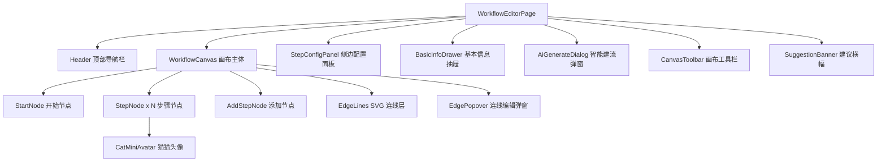

## 用户需求

将工作流编辑器的步骤编辑区域从纯列表表单模式升级为可视化节点画布模式。

## 产品概述

重构 WorkflowEditorPage 中的工作流步骤编辑交互，将原有的垂直列表表单替换为可视化节点画布，让用户通过拖拽节点、连线等直观操作来编排工作流步骤，同时保留所有现有功能（步骤配置、AI 智能建流、建议模式等）。

## 核心特性

### 1. 可视化节点画布

- 页面布局改为全屏画布为主体，取消原有的左右两栏布局中的"流程预览"区域（画布本身即为预览）
- 每个工作流步骤渲染为画布上的精简节点卡片，显示步骤序号、猫猫头像、猫猫名称、技能名称
- 画布支持缩放（滚轮）和平移（拖拽空白区域），节点支持自由拖拽定位
- 节点之间通过 SVG 曲线连线展示数据流向关系
- 画布中有一个"开始"入口节点和"添加步骤"尾部节点

### 2. 节点交互与侧边配置面板

- 单击节点：在右侧滑出配置面板，展示该步骤的完整配置（执行猫猫、技能、具体行为、用户参数配置）
- 配置面板复用现有的表单字段和交互逻辑
- 面板外点击或按 Esc 关闭面板
- 节点上方显示删除按钮（hover 时出现）

### 3. 可视化连线与数据流编辑

- 节点之间默认用带箭头的曲线连接，表示执行顺序和数据传递关系
- 默认连线指向"上一步"；若步骤设置了 inputFrom 则连线指向对应源节点
- 单击连线弹出小型下拉面板，可修改该步骤的 inputFrom 来源

### 4. 画布工具栏

- 顶部或画布角落放置轻量工具栏，包含：缩放控制（放大/缩小/重置）、基本信息入口按钮、自动排列按钮
- AI 智能建流做成工具栏上的浮动按钮，点击后弹出输入框弹窗
- 建议模式（suggestionMode）的提示面板改为画布上方的横幅通知条

### 5. 基本信息编辑

- 基本信息（名称、描述、触发方式、定时规则等）改为点击工具栏按钮后弹出的模态面板或侧边抽屉，不再占据画布空间

## 技术栈

- **前端框架**：React 19 + TypeScript（现有项目栈）
- **样式方案**：Tailwind CSS 4（现有项目栈）
- **画布渲染**：纯 SVG + CSS Transform 自研轻量画布引擎，不引入第三方 flow 库
- **构建工具**：Vite（现有项目栈）

### 不引入 reactflow 的原因

项目是轻量级应用，工作流步骤数量有限（通常 < 20 个节点），且当前项目零外部 UI 依赖。自研 SVG 画布约 400 行代码即可覆盖需求，避免引入 reactflow（约 400KB+ bundle）带来的体积膨胀和学习成本。

## 实现方案

### 整体策略

将 WorkflowEditorPage 从"左预览 + 右表单"的双栏布局重构为"全屏画布 + 浮动面板"的画布优先布局。核心思路是：

1. **画布层**：用一个 div 容器作为画布视口，内部用 CSS `transform: translate(x,y) scale(z)` 实现平移缩放，节点用绝对定位的 React 组件渲染，连线用 SVG 贝塞尔曲线绘制
2. **节点自动布局**：步骤节点按竖向流程自动排列（每个节点固定宽度，垂直间距均匀），用户可拖拽调整位置
3. **侧边配置面板**：点击节点后从右侧滑出，内容复用现有的步骤配置表单
4. **状态管理**：在现有 `steps` 状态基础上，新增 `nodePositions` 状态存储每个节点的 x/y 坐标（纯视觉层，不影响 WorkflowStep 数据模型）

### 关键技术决策

**自研轻量画布 vs reactflow**：选择自研。理由：节点数少、交互固定（无需分组/子流程/条件分支等复杂场景）、零依赖原则。画布核心逻辑封装为 `useCanvasViewport` hook（约 100 行），管理 panX/panY/zoom 三个值。

**SVG 连线方案**：在画布层渲染一个全尺寸 SVG，用二次贝塞尔曲线（`<path d="M...Q...">`)连接源节点底部中点到目标节点顶部中点。连线点击区域用透明粗描边（strokeWidth=12）扩大命中范围。

**节点位置管理**：节点坐标不持久化到后端，每次打开页面根据 steps 数组自动布局（竖向瀑布流），用户拖拽调整仅影响本次会话。这样不改变 WorkflowStep 数据结构，也不影响后端 API。

## 实现注意事项

### 性能

- 画布平移/缩放使用 CSS transform，由 GPU 合成层加速，不触发 layout/repaint
- 节点拖拽使用 `onPointerDown` + `pointermove` 而非 drag API，通过 `requestAnimationFrame` 节流更新位置，避免 React 重渲染瓶颈
- 连线 SVG path 的 d 属性通过 useMemo 缓存，仅在相关节点位置变化时重计算

### 向后兼容

- WorkflowStep 类型和后端 API 完全不变，画布只是 UI 层的升级
- handleSave、handleAiGenerate 等核心逻辑函数原封不动保留
- AI 生成结果写入 steps 后，画布自动重新布局

### 交互细节

- 画布空白区域双击 = 在点击位置添加新步骤
- 节点右键菜单（删除、复制步骤）
- 拖拽节点时，连线实时跟随更新
- 缩放范围限制在 0.3x ~ 2.0x，带平滑过渡

## 架构设计

### 系统架构



### 数据流

用户交互（拖拽节点 / 点击节点 / 编辑配置） --> 更新 steps + nodePositions 状态 --> React 重渲染画布节点 + SVG 连线 --> 保存时只提交 steps（nodePositions 不持久化）

### 模块划分

- **WorkflowCanvas**：画布视口、平移缩放、节点渲染容器
- **useCanvasViewport**：画布平移/缩放状态管理 hook
- **StepNode**：单个步骤节点卡片组件
- **EdgeLines**：SVG 连线渲染，计算贝塞尔曲线路径
- **EdgePopover**：连线点击后的 inputFrom 编辑弹窗
- **StepConfigPanel**：右侧滑出的步骤配置面板（复用现有表单字段）
- **BasicInfoDrawer**：基本信息编辑抽屉
- **AiGenerateDialog**：AI 智能建流浮动弹窗
- **CanvasToolbar**：画布工具栏（缩放、自动排列、入口按钮）
- **SuggestionBanner**：建议模式横幅通知条

## 目录结构

```
frontend/src/pages/TeamDetailPage/
├── WorkflowEditorPage.tsx          # [MODIFY] 页面主入口，重构布局为画布优先模式。保留所有状态管理和核心逻辑函数（handleSave/handleAiGenerate/updateStep/addStep/removeStep等），移除原有左右两栏布局和列表表单，改为渲染 WorkflowCanvas + 浮动面板组件。新增 nodePositions 状态和自动布局计算函数。
├── handleAiGenerateWorkflow.ts     # [不变] AI 生成逻辑，无需修改
├── workflow-canvas/
│   ├── WorkflowCanvas.tsx          # [NEW] 画布主体组件。包含画布视口容器（div + CSS transform 平移缩放）、节点渲染区域、SVG 连线层。接收 steps/cats/nodePositions 等 props，渲染 StartNode -> StepNode x N -> AddStepNode，管理节点拖拽逻辑。
│   ├── useCanvasViewport.ts        # [NEW] 画布视口 hook。管理 panX/panY/zoom 状态，处理鼠标滚轮缩放（0.3x~2.0x）、中键/空格拖拽平移、触控板手势。导出 viewportStyle 用于 CSS transform。
│   ├── StepNode.tsx                # [NEW] 步骤节点卡片组件。显示步骤序号圆圈、CatMiniAvatar 猫猫头像、猫猫名称、技能名称/图标、参数数量 badge。支持点击（选中并打开配置面板）、拖拽移动、hover 显示删除按钮。suggestionMode 下未配置猫猫的节点显示警告样式。
│   ├── EdgeLines.tsx               # [NEW] SVG 连线渲染组件。根据 steps 的 inputFrom 关系和 nodePositions 计算每条连线的贝塞尔曲线路径。渲染带箭头的曲线，支持点击连线触发 EdgePopover。透明粗描边扩大点击命中区域。
│   ├── EdgePopover.tsx             # [NEW] 连线编辑弹窗。点击连线后在连线中点位置弹出小型下拉，展示可选的数据来源步骤列表（与现有 inputFrom select 选项一致），选择后更新对应步骤的 inputFrom 字段。
│   ├── StepConfigPanel.tsx         # [NEW] 右侧滑出配置面板。展示被选中步骤的完整编辑表单：执行猫猫选择、技能选择、具体行为输入、用户参数配置（与现有表单完全一致）。带滑入/滑出动画，点击外部或 Esc 关闭。
│   ├── BasicInfoDrawer.tsx         # [NEW] 基本信息编辑抽屉。从右侧滑出，包含现有的全部基本信息字段：名称、描述、图标、触发方式、定时规则、开始/结束时间、定时调度开关、持久化开关。
│   ├── AiGenerateDialog.tsx        # [NEW] AI 智能建流弹窗。从工具栏按钮触发的模态弹窗，包含输入框和生成按钮，保留现有 AI 生成逻辑。生成结果自动写入 steps 并触发画布重新布局。
│   ├── CanvasToolbar.tsx           # [NEW] 画布浮动工具栏。固定在画布左下角或右下角，包含：缩放按钮组（-/重置/+）、自动排列按钮、基本信息按钮、AI 智能建流按钮。使用毛玻璃背景样式。
│   ├── SuggestionBanner.tsx        # [NEW] 建议模式横幅。suggestionMode 激活时在画布顶部显示横幅通知条，包含建议摘要文字、建议添加的猫猫/技能列表（可展开折叠）、关闭按钮。
│   └── canvas-utils.ts            # [NEW] 画布工具函数。包含：自动布局计算（根据步骤数量计算节点坐标）、贝塞尔曲线路径生成、节点尺寸常量、坐标碰撞检测等纯函数。
```

## 关键代码结构

```typescript
// workflow-canvas/canvas-utils.ts
/** 节点位置映射：key 为步骤 index，value 为画布坐标 */
export type NodePositions = Map<number, { x: number; y: number }>;

/** 画布视口状态 */
export interface ViewportState {
  panX: number;
  panY: number;
  zoom: number;
}

/** 根据步骤数量自动计算竖向布局坐标 */
export function autoLayout(stepCount: number): NodePositions;

/** 计算两个节点之间的贝塞尔曲线 SVG path */
export function computeEdgePath(
  from: { x: number; y: number },
  to: { x: number; y: number },
): string;
```

```typescript
// workflow-canvas/WorkflowCanvas.tsx - props 接口
interface WorkflowCanvasProps {
  steps: WorkflowStep[];
  cats: TeamCat[];
  nodePositions: NodePositions;
  selectedStepIndex: number | null;
  suggestionMode: boolean;
  onSelectStep: (index: number | null) => void;
  onNodeDrag: (index: number, pos: { x: number; y: number }) => void;
  onAddStep: () => void;
  onRemoveStep: (index: number) => void;
  onUpdateInputFrom: (index: number, inputFrom: string | undefined) => void;
}
```

## 设计风格

采用现代工具型产品的画布交互风格，参考 Dify / n8n 的节点编排体验，同时融入 CuCaTopia 项目自有的圆润可爱设计语言。画布背景使用淡色网格底纹，节点卡片延续项目现有的大圆角 + 轻投影设计。

## 页面设计

### 整体布局

- 全屏画布布局，顶部保留简洁导航栏（返回按钮 + 标题 + 保存按钮）
- 画布占据除导航栏外的全部空间，背景使用浅灰圆点网格（dot grid）
- 工具栏浮动在画布左下角，毛玻璃效果
- 右侧配置面板从画布边缘滑出，不遮挡画布中心区域

### 画布区域

- 背景：浅灰圆点网格，间距 20px，点大小 1px，颜色 border-strong
- 节点自上而下排列，默认垂直居中于画布
- 节点之间的连线为平滑贝塞尔曲线，颜色 accent-300，宽度 2px，终点带箭头
- 选中连线高亮为 accent-500

### 开始节点

- 小型圆形节点，直径 48px，accent-500 填充，白色播放图标
- 底部连线到第一个步骤节点

### 步骤节点卡片

- 宽度 220px，高度自适应（约 80-100px）
- 圆角 20px，白色背景，1px border-border 边框，轻微阴影
- 内部布局：左侧猫猫头像（32px），右侧步骤信息（猫猫名/技能名/行为摘要）
- 左上角步骤序号圆圈（accent-500 填充，白色数字）
- 选中态：border 变为 accent-400，加 ring-2 ring-accent-200，轻微放大 scale(1.02)
- hover 态：右上角显示删除按钮（圆形，danger 色）
- suggestionMode 未配置猫猫的节点：边框 amber-300，背景 amber-50，序号圆圈 amber-400

### 添加步骤节点

- 虚线边框的圆角矩形，宽度 220px
- 中间"+"号和"添加步骤"文字，hover 时边框和文字变 accent-400

### 工具栏

- 固定左下角，距边缘 16px
- 水平排列的按钮组，圆角 16px，背景 white/80 + backdrop-blur
- 按钮：缩放减 / 缩放百分比显示 / 缩放加 / 分隔线 / 自动排列 / 基本信息 / AI 建流
- 按钮 hover 时 bg-surface-tertiary

### 右侧配置面板

- 宽度 380px，从右侧滑入，白色背景，左边框 border-border
- 顶部：步骤序号 + 猫猫名称 + 关闭按钮
- 内容区：复用现有表单字段（执行猫猫下拉、技能下拉、行为输入、参数配置折叠区）
- 进入动画：translateX(100%) -> translateX(0)，300ms ease-out

### 基本信息抽屉

- 与配置面板相同位置和宽度，从右侧滑入
- 复用现有基本信息表单字段

### AI 智能建流弹窗

- 画布中央弹出的模态对话框，宽度 480px
- 毛玻璃遮罩，圆角 24px 白色面板
- 内含输入框 + 生成按钮 + 加载态

### 建议横幅

- 画布顶部水平横幅，amber 色系（与现有建议面板色系一致）
- 单行摘要 + 展开按钮 + 关闭按钮
- 展开后显示建议猫猫/技能列表

## Agent Extensions

### SubAgent

- **code-explorer**
- 用途：在实现各个步骤时，按需探索现有组件的详细实现和样式模式，确保新组件与项目风格一致
- 预期结果：获取 CatMiniAvatar、Toast、现有 CSS 动画等组件的完整接口和用法